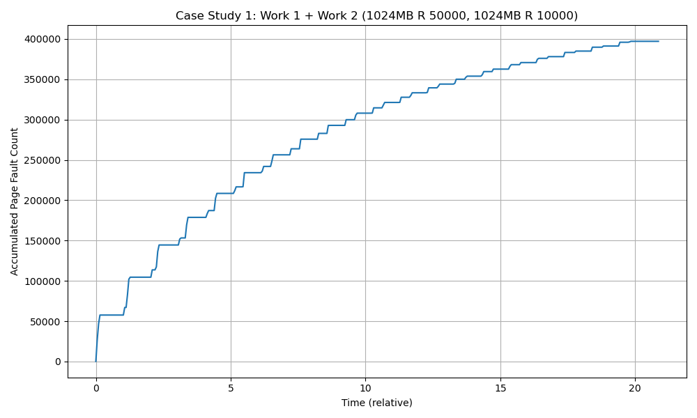
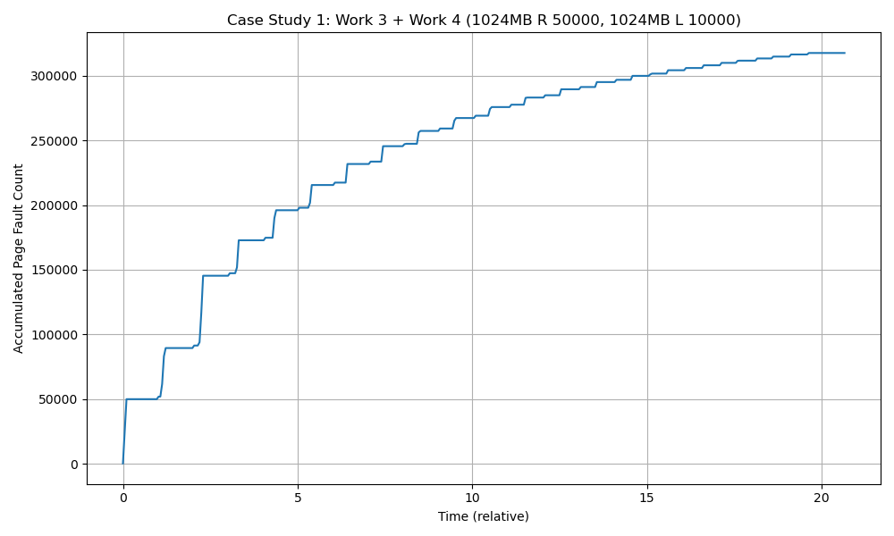
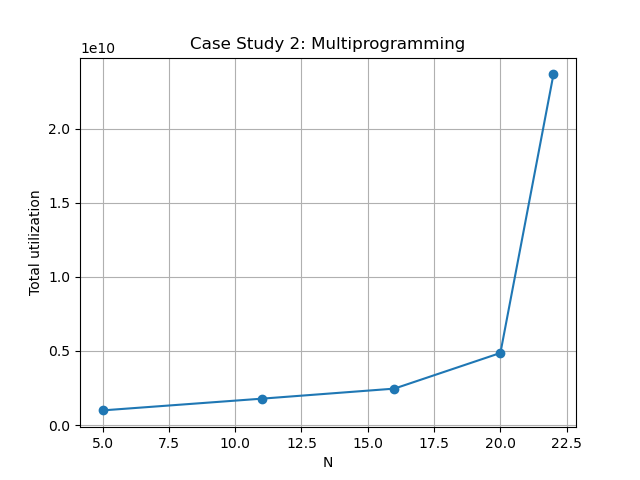

# UIUC CS 423 MP3

Your Name: Kaiyang Teng

Your NetID: Kteng4

## Project Introduction
The objective of this MP3 is to implement a Linux kernel module that periodically samples the page faults and CPU utilization of registered processes, and maps the in-kernel profiler buffer to user space—via a character device and mmap()—for reading and analysis by a monitoring program.

## Implementation

I implemented the proc filesystem entry /proc/mp3/status to support the two required commands, `R <PID>` for registration and `U <PID>` for unregistration, and to return the list of currently registered PIDs when read. Internally, the module maintains a linked list of registered processes. When the first process is registered, the delayed work queue is started, and when the list becomes empty, the work queue is stopped.

For the profiler buffer, I used vmalloc() to allocate a virtually contiguous memory region and initialized the buffer to -1, as expected by the provided monitor program. The delayed work queue runs 20 times per second and collects the soft / hard page fault count, and CPU utilization of all registered processes. These values are summed and written into the buffer as one sample.

I also implemented the char device interface required for user-space access. The mmap callback maps the profiler buffer into the virtual address space of the monitor process. For each page in the buffer, the module uses vmalloc_to_pfn() to obtain the page frame number and remap_pfn_range() to create the mapping. This allows the monitor program to read profiling results directly from shared memory.

## Case Study 1: Thrashing and Locality

The first experiment compares two random-access workloads: 1024MB R 50000 and 1024MB R 10000. The accumulated page fault count rises steadily over time, and the total page fault count is relatively high. This is expected because both processes use random access, which provides poor locality and causes frequent page faults. The heavier access rate in the first workload also increases memory pressure and contributes to the overall fault growth. 

  

In the second experiment, the workloads are 1024MB R 50000 and 1024MB L 10000. Compared with the first graph, the accumulated page fault count is lower. The main reason is that the locality-based workload reuses nearby pages more effectively, so fewer new pages need to be brought into memory. As a result, page fault pressure is reduced and the workload completes more efficiently. This shows that locality has a direct impact on virtual memory performance. 

  

## Case Study 2: Multiprogramming

In this experiment, I ran N copies of the workload 200MB R 10000 with N = 5, 11, 16, 20, 22, and plotted total CPU utilization against the degree of multiprogramming. As N increases from 5 to 20, total utilization also increases because more processes are running concurrently. However, when N reaches 22, the total utilization rises very sharply. This indicates that completion time becomes much longer under heavy memory pressure. Since each process uses 200MB and accesses memory randomly, the total working set at high N exceeds physical memory, leading to frequent page faults, swap activity, and eventually thrashing. So the accumulated utilization becomes much larger. 

  

## Conclusion

The experimental results are consistent with the concepts discussed in class: random access leads to more page faults than locality-based access, and increasing the degree of multiprogramming eventually causes severe memory contention and thrashing when the total working set exceeds available memory. 

